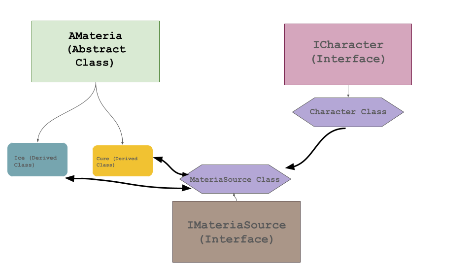

# C++ Polymorphism and Abstract Classes Module

## Overview

This module focuses on key C++ concepts including Subtype Polymorphism, Abstract Classes, Interfaces, and their practical applications in object-oriented programming. The exercises are designed to provide hands-on experience with these concepts, illustrating their use in various scenarios.

### Key Concepts

- **Subtype Polymorphism**: Involves treating derived class objects as objects of a common superclass, with base class pointers pointing to objects of any of its subclasses.

- **Dynamic Binding**: The method call is resolved at runtime based on the object's type, not the pointer's type.

- **Abstract Classes**: Classes with at least one pure virtual function. They cannot be instantiated and serve as base classes for other classes.

- **Interfaces**: Classes with only pure virtual functions, defining a contract for implementing classes without specifying implementation details.

- **Object Slicing**: Occurs when a subclass object is assigned to a superclass object, leading to loss of subclass-specific attributes or methods.

- **Dynamic and Static Cast**: Used for type conversion; dynamic cast checks type safety at runtime, while static cast doesn't and is faster.

## Exercises

### Ex00: Basic Polymorphism

- **Objective**: Implement an Animal class with a protected attribute 'type' and a virtual function 'makeSound()'.
- **Details**: Develop Dog and Cat classes that override 'makeSound()'. Illustrate subtype polymorphism and dynamic binding with base class pointers to derived class objects.

### Ex01: Brain Class Integration

- **Objective**: Introduce a Brain class, allowing Dog and Cat instances to have a dynamically allocated Brain.
- **Implementation**: Add virtual functions in Animal class for Brain operations. Implement deep copies to avoid shallow copy issues.
- **Demonstration**: Show object slicing in main function test.

### Ex02: Abstract Animal Class

- **Objective**: Convert the Animal class into an abstract class by defining pure virtual functions.
- **Implementation**:
  ```cpp
  virtual Brain* getBrain() const = 0;
  virtual void setIdea(std::string idea, int index) = 0;
  virtual std::string getIdea(int index) const = 0;
  ```

### Ex03: Interfaces, Abstract and Derived classes that interconnect

- **Objective**: Construct a system with materials, material sources, and characters, inspired by Minecraft.
- **Components**:
  - Materials and their source management.
  - Characters with abilities to equip/unequip materials.
  - MateriaSource class for memory management of materials.
  - Ice and Cure as types of Materials.
  - AMateria arrays to hold different derived classes.

<p align="center">
  
</p>


## Conclusion

This module provides a comprehensive understanding of polymorphism, abstract classes, and interfaces in C++, with practical examples and exercises to reinforce learning.
